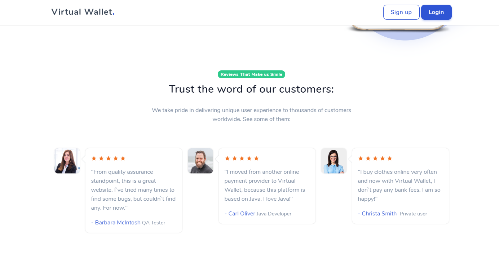
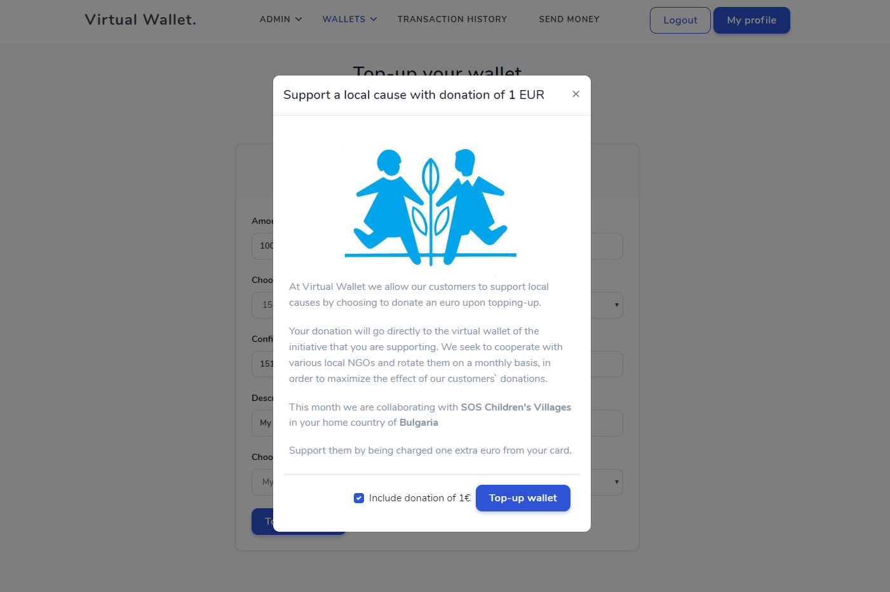

## Final Team Project at Telerik Academy: Virtual Wallet Web Application

*I am happy to provide the commit history upon request.*

### Short description: 
We have developed a fintech web application, where users can send money online through their virtual wallets. Users can create their own virtual wallets, add credit cards and top-up money from an external "banking" API that our system uses. They can then send money from their wallets to other users. There a number of features implemented, such as:
* Email confirmation for new users.
* Email confirmation for large transactions with an expiry period.
* Multiple cards (edit/delete) and wallets ("make primary wallet" feature).
* Referral system, where users can refer their friends by having our system send a registration link via an e-mail and receive 20 euro bonus, if the registration is completed within the expiry period
* Detailed Transaction History, where users can filter Transactions by Date, Direction (Incoming/Outgoing), Counterparty, and sort by Amount and Date.
* Under the "My profile" page, the user can see his personal information, his default wallet and total saldo, latest 3 transactions and a bonus feature of "inspirational quotes". Users can edit their personal details and change passwords. 
* Donation feature, where users can choose to donate a euro upon topping-up (just like with some Bulgarian ATMs). The money go to a specifically created Donation Project User Account, and the total gathered sum from donations is visible on the homepage.

**We have used the following backend technologies:**
* Spring MVC and Spring Boot framework
* Hibernate
* Spring security

**Additionally, we have used the following frontend technologies:**
* Spring MVC Framework with Thymeleaf template engine
* JavaScript and jQuery custom functions to help with certain features (e.g. popup modal confirming Transaction details)
* A free CSS template which we further customized.

### How to build and run the project:

Firstly, download the project folder. 

To use the project, a MariaDB database is required. The necessary login credentials should be updated in the **application.properties** file located under VirtualWallet\src\main\resources.

Then, the scripts for creating the database schema can be found in VirtualWallet\src\main\resources\sql\schema.sql.

The test data with all SQL scripts can be found in VirtualWallet\src\main\resources\sql\schema-data.sql.

Then, to build and run the project, assuming you are using IntelliJ IDEA Ultimate Edition, simply run **VirtualWalletApplication.class** located under VirtualWallet\src\main\java\a16team1\virtualwallet.

### Screenshots of the application:

#### Home page:

#### Sign-up and login:

#### My profile and edit details:

#### Transaction history and filtering:

#### Making a transaction:

#### Add funds to wallet with Donation feature:

#### Wallets and cards:

